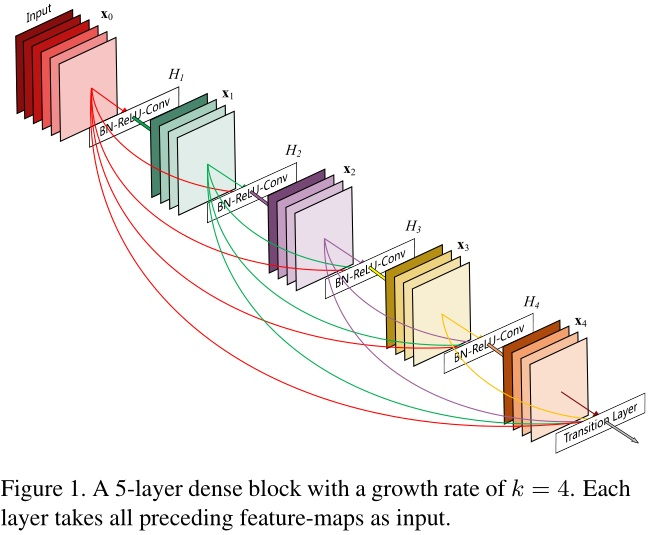

## DenseNet

- [Densely Connected Convolutional Networks](https://arxiv.org/abs/1608.06993)

密集卷积网络（Dense Convolutional Network，DenseNet），网络中的层会与它之前的所有层直接连接。具有L层的传统卷积网络中有L条连接，而DenseNet中有L(L+1)/2条直接连接线路。对于网络中的每一层，在它之前的所有层所生成的特征图（feature-maps）都会作为该层的输入。DenseNet的优点有：缓解梯度消失问题，增强特征在网络中的传输，特征可重复利用，大幅降低网络参数数量。

ResNet使用加法操作来连接不同分支的输出，而DenseNet使用沿通道维度串联的方式来整合输出。
DenseNet需要的参数规模比传统的卷积网络更小，这是因为它不需要重新学习那些冗余的特征图。

网络结构：

ResNet在层间中加入一个恒等映射的快捷连接：
 

ResNet的优点是后面层中的梯度可以通过恒等函数直接传输到前面的层。但是 ResNet中恒等连接的输出与残差函数的输出通过加法操作进行连接，可能会影响网络中的信息流动 。

 DenseNet中的每一层与它所有的后续层都有直接连接，每一层的输入包含它之前所有层所产生的特征图
 
Hl(.)是一个Composite function，是三个操作的组合：BN−>ReLU−>Conv(3×3)，见上结构图。
由于串联操作要求特征图x0,x1,...,xl−1大小一致，而Pooling操作会改变特征图的大小，又不可或缺，于是就有了分块想法，其实这个想法类似于VGG模型中的“卷积栈”的做法。论文中称每个块为DenseBlock。每个DenseBlock的之间层称为transition layers，由BN−>Conv(1×1)−>averagePooling(2×2)组成。

网络结构：

得益于密集连接的方式，DenseNet可以同时具有恒等映射（identity mapping）、深度监督（deep supervision）和深度多样性（diversified depth）的特性。DenseNet可以重复利用网络中的特征，学习到更简洁、准确率更高的模型。由于它内部表示的简洁以及对冗余特征的缩减，DenseNet可以在多种计算机视觉任务中作为特征提取器。

