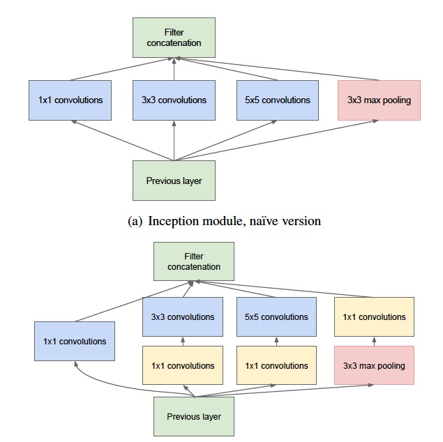
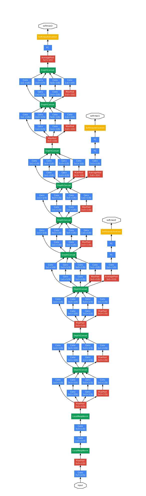
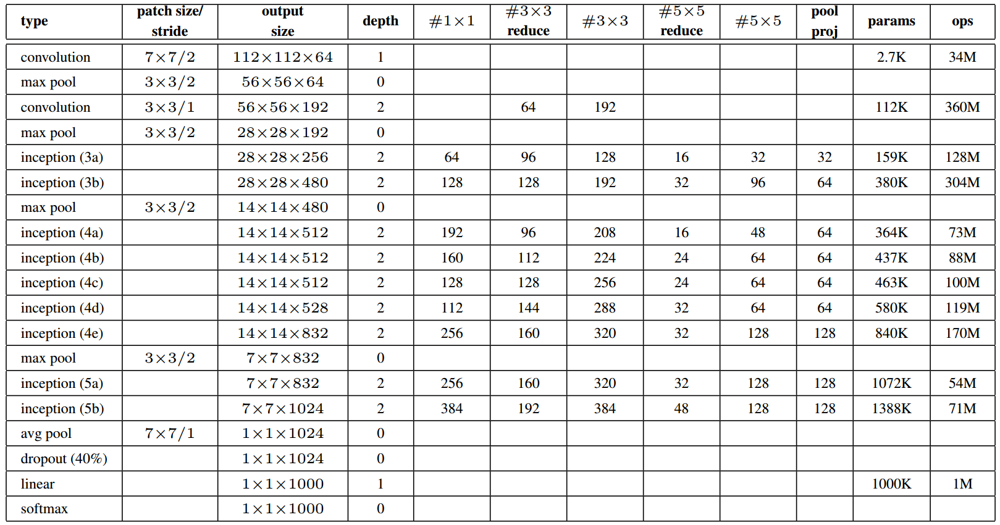

GoogLeNet v1-v4：

- [v1][Going Deeper with Convolutions](https://arxiv.org/abs/1409.4842)，ensemble top5 error 6.67%，2014
- [v2] [Batch Normalization: Accelerating Deep Network Training by Reducing Internal Covariate Shift](https://arxiv.org/abs/1502.03167)，ensemble top5 error 4.8%，2015
- [v3][Rethinking the Inception Architecture for Computer Vision](https://arxiv.org/abs/1512.00567)，ensemble top5 error 3.5%，2015
- [v4][Inception-v4, Inception-ResNet and the Impact of Residual Connections on Learning](https://arxiv.org/abs/1602.07261)，ensemble top5 error 3.08%，2016


### Inception v1
GoogLeNet这个名字的由来是Google向LeNet致敬。而Inception，是来自电影《盗梦空间》的表情包"We need go to deeper"。GoogLeNet是Inception v1的一个实现范例，是Inception的一个实例，是一种Inception v1网络，经过实验证明，效果比较好的一种网络结构安排。


Inception module 的提出主要考虑多个不同 size 的卷积核能够增强网络的适应力，分别使用1*1、3*3、5*5卷积核，同时加入3*3 max pooling。

naive 结构存在着问题：每一层 Inception module 的 filters 参数量为所有分支上的总数和，多层 Inception 最终将导致 model 的参数数量庞大，对计算资源有更大的依赖。

所以文章提出了**Inception module with dimension reduction**，在不损失模型特征表示能力的前提下，尽量减少 filters 的数量，达到降低模型复杂度的目的。Inception Module 的4个分支在最后通过一个聚合操作合并。tensorflow的代码如下：
```python
tf.concat(3, [branch1x1, branch5x5, branch3x3, branch_pool])
```
对比图如下：

如上图，卷积核参数的前后对比`1×1×192×64+3×3×192×128+5×5×192×32`，`1×1×192×64+1×1×192×96+3×3×96×128+1×1×192×16+5×5×16×32`，将模型参数减少到原来的三分之一左右。为了减少维度，在pooling层之后也使用1×1的滤波器来进行降维。并且1×1的滤波器还可以用来进行修正线性激活。

网络太深的话不好训练，所以网络中还加了两个侧枝**auxiliary classifiers**，用于辅助训练，通过中间层的分类损失，监督网络，起正则化作用并补充梯度。在测试的时候，侧枝扔掉不用。


主要用了池化、1x1、3x3和5x5卷积。然后最后一个卷积层出来的全连接，由全局平均池化替代，减少了参数节约了计算量。

模型的参数：

