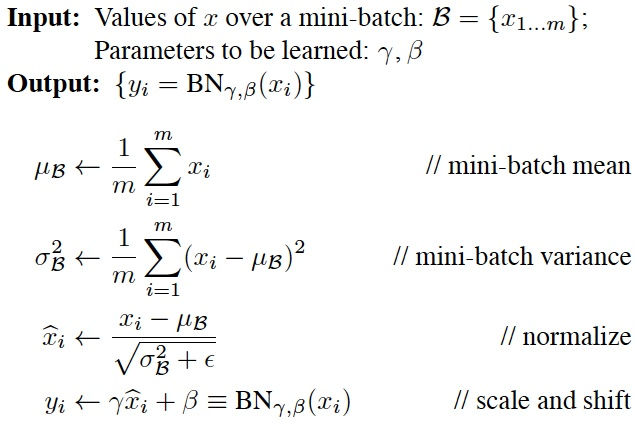
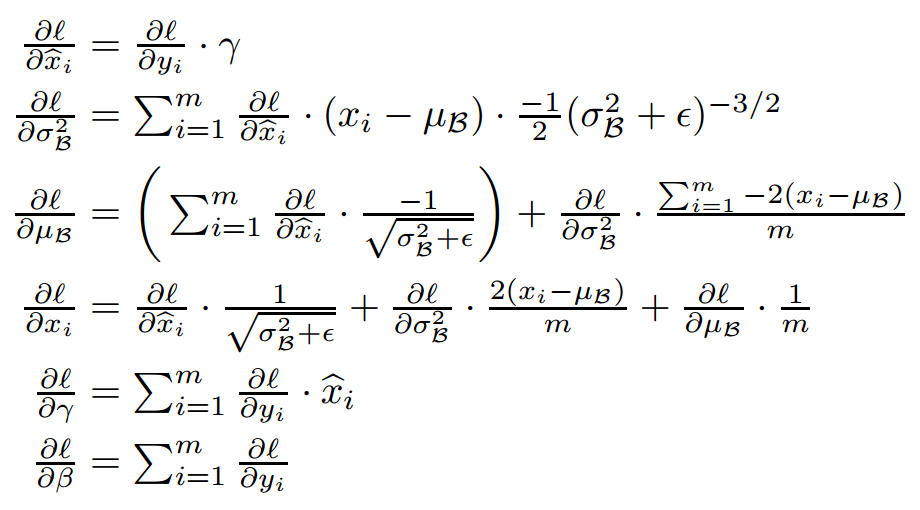
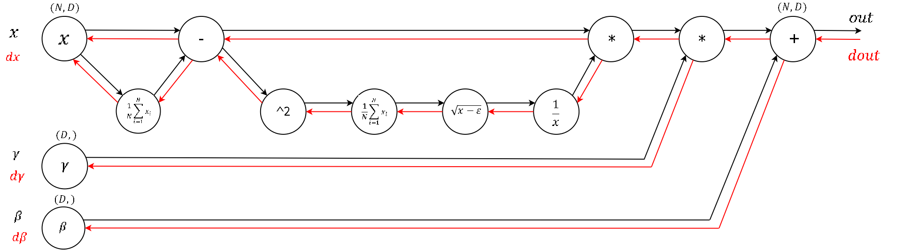
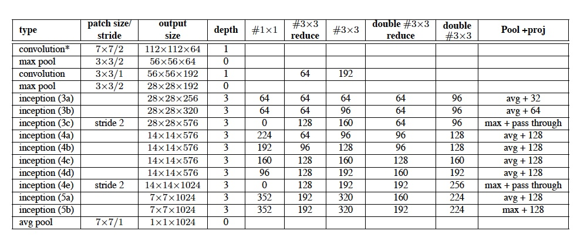

### Inception v2:

- [Batch Normalization: Accelerating Deep Network Training by Reducing Internal Covariate Shift](https://arxiv.org/abs/1502.03167)，ensemble top5 error 4.8%，2015


### 
Inception v2的贡献是加入了BN（Batch Normalization）层，并且使用2个3*3替代1个5*5卷积。

(1)加入了BN层，减少了InternalCovariate Shift（内部neuron的数据分布发生变化），使每一层的输出都规范化到一个N(0, 1)的高斯，从而增加了模型的鲁棒性，以更大的学习速率训练，收敛更快，初始化操作更加随意，同时作为一种正则化技术，可以减少dropout层的使用。
BN的前向公式（m是mini-batch size）：


```python
# 
def batchnorm_forward(x, gamma, beta, eps):

  N, D = x.shape
  #为了后向传播求导方便，这里都是分步进行的
  #step1: 计算均值
  mu = 1./N * np.sum(x, axis = 0)

  #step2: 减均值
  xmu = x - mu

  #step3: 计算方差
  sq = xmu ** 2
  var = 1./N * np.sum(sq, axis = 0)

  #step4: 计算x^的分母项
  sqrtvar = np.sqrt(var + eps)
  ivar = 1./sqrtvar

  #step5: normalization->x^
  xhat = xmu * ivar

  #step6: scale and shift
  gammax = gamma * xhat
  out = gammax + beta

  #存储中间变量
  cache =  (xhat,gamma,xmu,ivar,sqrtvar,var,eps)

  return out, cache
```

BN的反向传播（需要调节的参数，γ 和 β）

```python
def batchnorm_backward(dout, cache):

  xhat,gamma,xmu,ivar,sqrtvar,var,eps = cache

  N,D = dout.shape

  #step6
  dbeta = np.sum(dout, axis=0)
  dgammax = dout
  dgamma = np.sum(dgammax*xhat, axis=0)
  dxhat = dgammax * gamma

  #step5
  divar = np.sum(dxhat*xmu, axis=0)
  dxmu1 = dxhat * ivar #注意这是xmu的一个支路

  #step4
  dsqrtvar = -1. /(sqrtvar**2) * divar
  dvar = 0.5 * 1. /np.sqrt(var+eps) * dsqrtvar

  #step3
  dsq = 1. /N * np.ones((N,D)) * dvar
  dxmu2 = 2 * xmu * dsq #注意这是xmu的第二个支路

  #step2
  dx1 = (dxmu1 + dxmu2) #注意这是x的一个支路


  #step1
  dmu = -1 * np.sum(dxmu1+dxmu2, axis=0)
  dx2 = 1. /N * np.ones((N,D)) * dmu #注意这是x的第二个支路

  #step0 done!
  dx = dx1 + dx2

  return dx, dgamma, dbeta
```

前向传播和后向传播的流程图


(2)用2个连续的3*3 conv替代inception模块中的5*5，从而实现网络深度的增加，网络整体深度增加了9层，缺点就是增加了25%的weights和30%的计算消耗。


