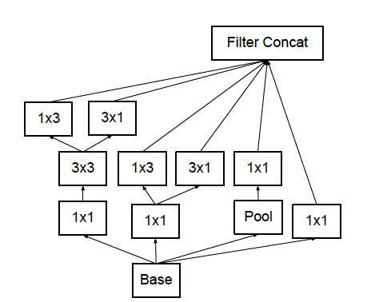

### Inception v3:

-  [Rethinking the Inception Architecture for Computer Vision](https://arxiv.org/abs/1512.00567)，top5 error 3.5%

Inception v3网络，主要在v2的基础上，提出了卷积分解，进一步降低计算量。如一层5x5卷积可以用两层3x3卷积替代，而一层3x3卷积又可以用一层1x3卷积和3x1卷积替代。

作者总结了四条神经网络结构设计时候的原则：
- 尽量避免bottleneck（一般发生在pooling层），虽然可以降维降低计算量，但是也会丢失信息。
- 用更高维度的特征表示，更稀疏，耦合更少，更好训练
- 大的filters拆分成较小的，比如用1x1卷积降低通道数，信息丢失很少
- 平衡神经网络的深度和宽度

inception v3的特点：
(1) 将7*7分解成两个一维的卷积（1*7,7*1），3*3也是一样（1*3,3*1），这样的好处，既可以加速计算，又可以使网络深度增加，增加了网络的非线性，更加精细设计了35*35/17*17/8*8的模块。
(2)增加网络宽度，网络输入从224*224变为了299*299。
(3)Label smooth,标签平滑正则.公式如下：
`new_labels = (1.0 - label_smoothing) * one_hot_labels + label_smoothing / num_classes`

卷积分解的示例：

