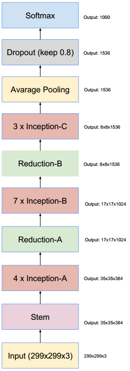

### Inception v4 和 Inception-ResNet:

- [Inception-v4, Inception-ResNet and the Impact of Residual Connections on Learning](https://arxiv.org/abs/1602.07261)，top5 error 3.08%


结合ResNet与GoogLeNet,主要利用残差连接（Residual Connection）来改进v3结构，代表作为，Inception-ResNet-v1，Inception-ResNet-v2，Inception-v4。加入了Residual Connections以后，使得训练加速收敛更快，精度更高。在网络复杂度相近的情况下，Inception-ResNet-v2略优于Inception-v4。

resnet中的残差结构如下，这个结构设计的就很巧妙，简直神来之笔，使用原始层和经过2个卷基层的feature map做Eltwise。Inception-ResNet的改进就是使用上文的Inception module来替换resnet shortcut中的conv+1*1 conv。

Inception v4的结构图：


引入residual connection直连，把Inception和ResNet结合起来，让网络又宽又深，提除了两个版本：
- Inception-ResNet v1：Inception加ResNet，计算量和Inception v3相当，较小的模型
- Inception-ResNet v2：Inception加ResNet，计算量和Inception v4相当，较大的模型，准确率也更高。

Inception-ResNet的结构图：


Residual Connection
原作者指出residual connection并不会明显提升模型精度，而是会加快训练收敛。引入了residual connection以后，网络太深了不稳定，不太好训练，而通过引入scale（Inception框可以用任意sub-network替代，输出乘以一个很小的缩放系数，通常0.1左右，再相加再激活）
```python
def forward(self, x):
    out = self.conv2d(x)  # 可以是卷积层、可以是Inception模块等任意sub-network
    out = out * self.scale + x  # 乘以一个比例系数再相加
    out = self.relu(out)
    return out
```

