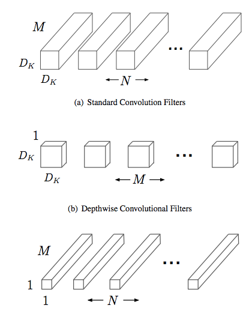
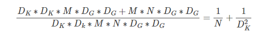
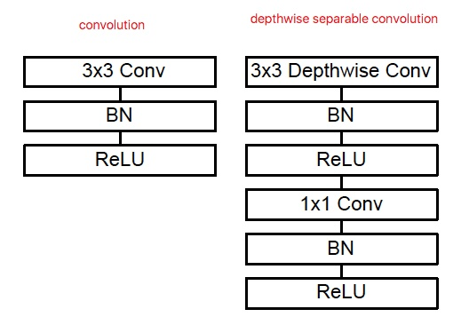
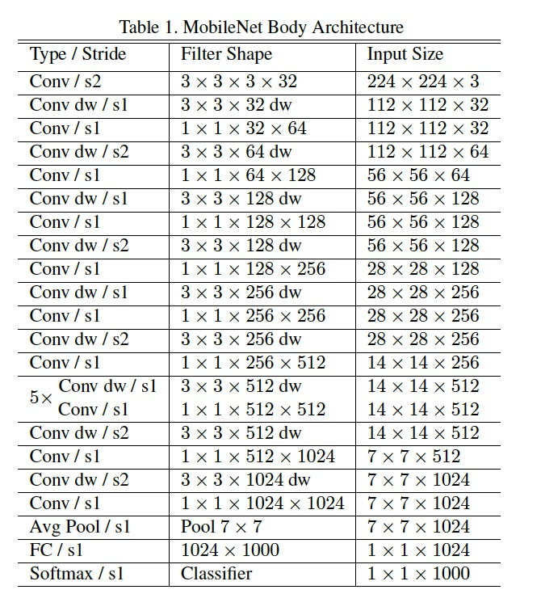

## MobileNet:

- 论文：[MobileNets: Efficient Convolutional Neural Networks for Mobile Vision Applications](https://arxiv.org/abs/1704.04861)

MobileNet是能够在移动端使用的网络模型,采用名为depth-wise separable convolution 的卷积方式代替传统卷积方式，以达到减少网络权值参数的目的。  
引入了两个超参数，用于选择合适大小的模型：
α：Width Multiplier，得到Thinner Models，对输入和输出的feature map的通道数乘以该系数，让每一层都更轻，得到更瘦的网络，实验证明，这种方式减小网络，比单纯减少网络层数得到更浅的网络，准确率更高。α通常取0.25、0.5、0.75、1（1是原始完整的基准网络）
ρ：Resolution Multiplier，得到Reduced Representation，实际是直接修改输入网络的图像的大小，可以有效减少计算量，通常输入图像大小为128、160、192、224（224是原始完整的基准网络）

将标准卷积层分解为depthwise conv和 pointwise conv(1*1)两个卷积层。即一个depthwise separable卷积核包括depthwise卷积操作和pointwise卷积操作。

Standard Convolution Filters:   
$D_K*D_k*M*N*D_G*D_G$

Depthwise Concolution Filters:   
$D_K*D_K*M*D_G*D_G+M*N*D_G*D_G$

第一步是depthwise卷积，第二步是pointwise卷积。其中：$D_K$表示卷积核大小，M表示输入特征图的深度，$D_G$表示输出特征图的大小，N表示输出特征图的深度。

压缩比为：
$\frac{D_K*D_K*M*D_G*D_G+M*N*D_G*D_G}{D_K*D_k*M*N*D_G*D_G} = \frac{1}{N}+\frac{1}{D_K^2}$

depthwise separable convolution的具体结构（与Xception类似）：

输入的J个通道，每个通道有一个卷积核卷积对应通道，得到J个输出激活图，然后K个1x1卷积核，做普通的卷积，得到K个最终输出的激活图像。

和Xception不同，在前后两部分操作之间，添加了非线性激活：

MobileNet的结构：

