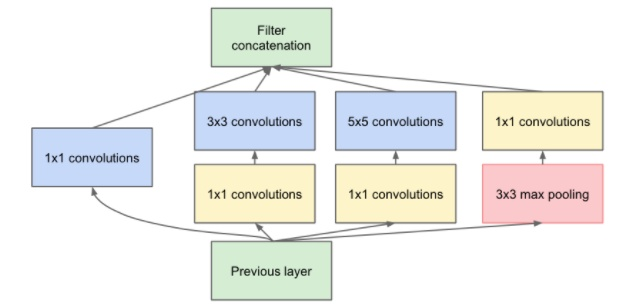

## ResNeXt

- [Aggregated Residual Transformations for Deep Neural Networks](https://arxiv.org/abs/1611.05431)   ImageNet Top5错误率：3.03%

ResNeXt的最大优势在于整个网络的building block都是一样的，不用在每个stage里再对每个building block的超参数进行调整，只用一个building block，重复堆叠即可形成整个网络。实验结果表明ResNeXt比ResNet在同样模型大小的情况下效果更好。

Inception把ResNet拿来搞了Inception-ResNet，ResNet也把Inception拿来搞了一个ResNeXt，主要就是单路卷积变成多个支路的多路卷积，不过分组很多，结构一致，进行分组卷积。所有Inception模型都遵循 拆分-变换-合并（split-transform-merge） 的设计策略。如下图，先将输入分配到多路，然后每一路进行转换，最后再把所有支路的结果融合。

左边是ResNet的基本结构，右边是ResNeXt的基本结构。实际上是将左边的64个卷积核分成了右边32条不同path，每个path有4个卷积核，最后的32个path将输出向量直接pixel-wise相加（所有通道对应位置点相加），再与Short Cut相加。

模型容量有宽度（width)和高度(height)这两种属性，而Cardinality指的是网络结构中的building block的变换的集合大小（the size of the set of transformation），上图右边的 ResNeXt 中分支的个数就是 cardinality。
下图三种结构是等价的，实际上Cardinality指的就是（b）中path数或（c）中group数，即每一条path或者每一个group表示一种transformation，因此path数目或者group个数即为Cardinality数。

Bottleneck指的是在每一个path或者group中，中间过渡形态的feature map的channel数目（或者卷积核个数），如（a）中，在每一条path中，对于输入256维的向量，使用了4个`1*1*256`的卷积核进行卷积后得到了`256*4`的feature map，即4个channel，每个channel的feature map大小为256维，因此，Bottleneck即为4。

基数(Cardinality)是与深度、宽度同样重要的维度，实验证明通过**增大基数来提升网络性能比深度、宽度更有效**，尤其是当深度/宽度的影响开始出现衰减时。
ResNeXt比ResNet更好，而且Cardinality越大效果越好
增大Cardinality比增大模型的width或者depth效果更好