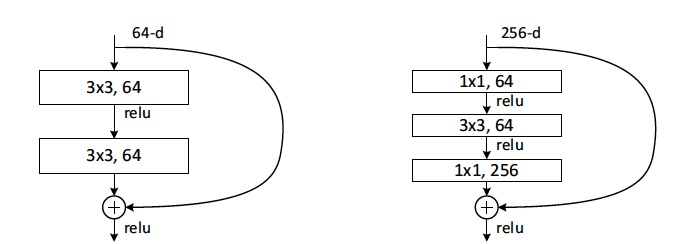
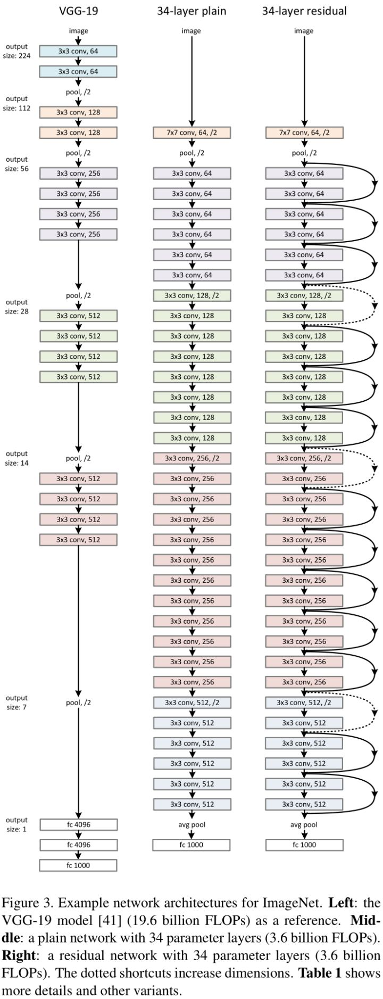
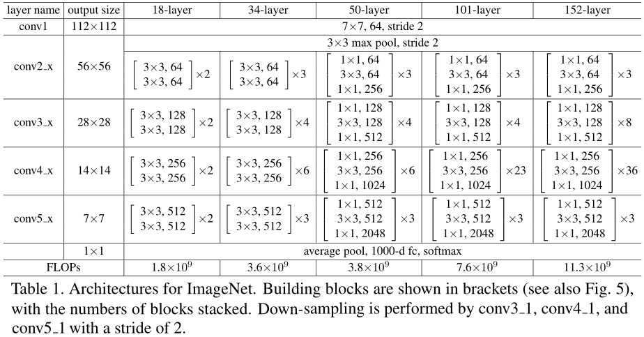

## ResNet

- 论文：[Deep Residual Learning for Image Recognition](https://arxiv.org/abs/1512.03385) mageNet Top5错误率： 3.57%

ResNet主要的特点是Residual Networks 残差网络。

Residual的结构：

增加一个identity mapping（恒等映射），将原始所需要学的函数H(x)转换成F(x)+x。Residual block通过shortcut connection实现，通过shortcut将这个block的输入和输出进行一个element-wise的加叠，这个简单的加法并不会给网络增加额外的参数和计算量，同时却可以大大增加模型的训练速度、提高训练效果，并且当模型的层数加深时，这个简单的结构能够很好的解决退化问题。

网络由两种不同的基本单元堆叠：

左边是BasicBlock，ResNet18和ResNet34就由其堆叠。右边BottleNeck，多加一层，用1x1的卷积先降维再升维，ResNet50、ResNet101、ResNet152就由其堆叠。

使用不同网络的配置：

从上图可以看到，ResNet共有5组卷积，第一组卷积的输入大小是224x224，第五组卷积的输出大小是7x7，缩小32倍，且每次都是在每组卷积的第一层上使stride为2。

