## CNN 回顾

### 经典网络
经典网络包括LeNet、AlexNet以及VGG等。

- LeNet： [1998，Gradient based learning applied to document recognition](http://yann.lecun.com/exdb/publis/pdf/lecun-01a.pdf)

用于手写数字识别，可以看到，卷积神经网络的基本框架已经有了，卷积、激活、池化和全连接，这几个基本组件都完备了。

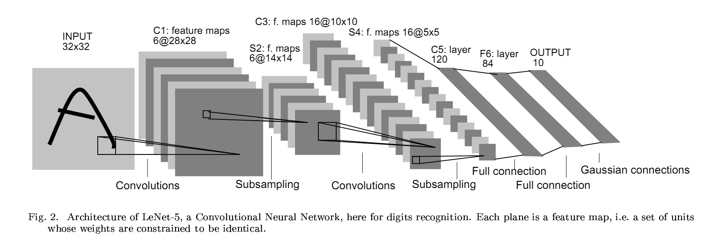

之后，深度学习并没有太多的突破。一直到AlexNet的出现。为什么是2012年？一是数据，之前并没有大规模的数据进行充分的训练，现在有ImageNet；二是计算，之前的硬件条件限制无法进行大规模的训练，而现在有了性能强大的GPU；三就是AlexNet本身很优秀，给后来的网络奠定了一个很好的基础。

- AlexNet：[2012，ImageNet Classification with Deep Convolutional Neural Networks](https://papers.nips.cc/paper/4824-imagenet-classification-with-deep-convolutional-neural-networks.pdf)  ImageNet Top5错误率：16.4%

AlexNet总体结构和LeNet相似，但是有极大改进：
- 由五层卷积和三层全连接组成，输入图像三通道是224x224，网络规模远大于LeNet
- 使用了ReLU激活函数
- 使用了Dropout，可以作为正则项防止过拟合，提升模型鲁棒性
- 一些很好的训练技巧，包括数据增广、学习率策略、weight decay等

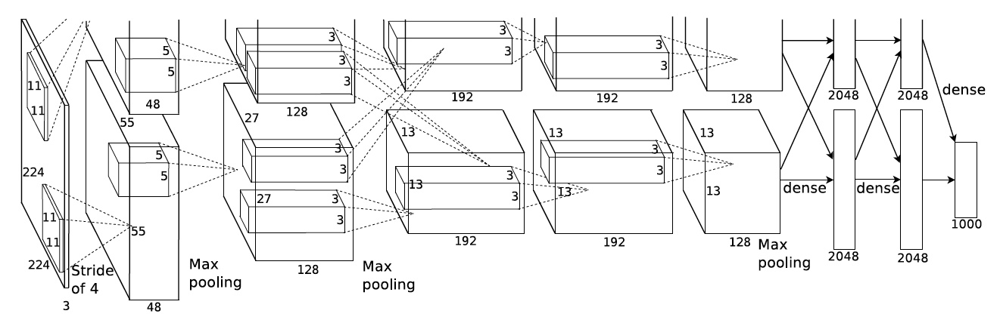
AlexNet使用3GB显存的GTX 580显卡，一块显卡不够用，所以将模型分为两部分放到了两块显卡上并行运算（如上图所示）。这种分组卷积的思想被后来的网络采用。

- VGG： [2014，Very deep convolutional networks for large-scale image recognition](https://arxiv.org/pdf/1409.1556.pdf)  ImageNet Top5错误率: 7.3%

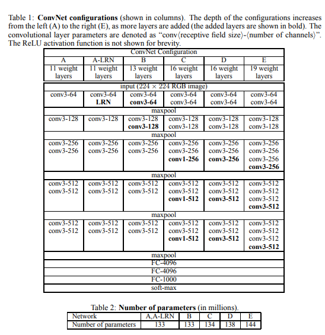

主要改进就是：网络层数由AlexNet的8层增至16和19层，更深的网络意味着更强大的网络能力，也意味着需要更强大的计算力。同时只使用3x3的卷积核，因为两个3x3的感受野相当于一个5x5，同时参数量更少，之后的网络都基本遵循这个范式。

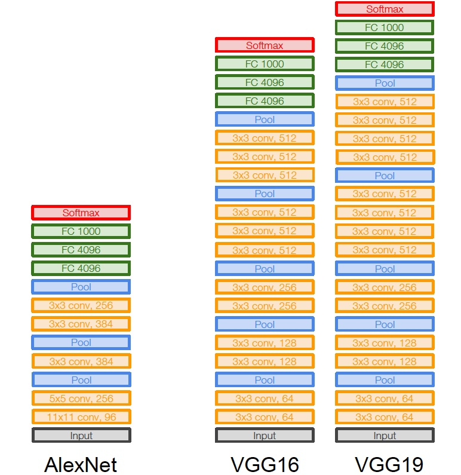

VGG是集大成者，之后很难再进一步，继续简单增加网络层数会遇到问题，更深的网络更难训练同时参数量也在不断增长。

GoogLeNet：
- [v1 Going Deeper with Convolutions](https://arxiv.org/abs/1409.4842)， top5 error 6.67%，2014
- [v2 Batch Normalization: Accelerating Deep Network Training by Reducing Internal Covariate Shift](https://arxiv.org/abs/1502.03167)， top5 error 4.8%，2015
- [v3 Rethinking the Inception Architecture for Computer Vision](https://arxiv.org/abs/1512.00567)， top5 error 3.5%，2015
- [v4 Inception-v4, Inception-ResNet and the Impact of Residual Connections on Learning](https://arxiv.org/abs/1602.07261)， top5 error 3.08%，2016

GoogLeNet则从另一个维度来增加网络能力，每单元有许多层并行计算，让网络更宽了。
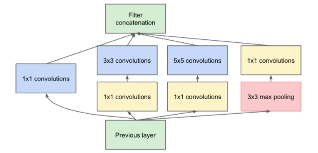

通过网络的水平排布，可以用较浅的网络得到很好的模型能力，并进行多特征融合，同时更容易训练，另外为了减少计算量，使用了1x1卷积来先对特征通道进行降维。堆叠Inception模块而来就叫Inception网络。但是，网络太深无法很好训练的问题还是没有解决，直到ResNet提出了residual connection。

- ResNet：[Deep Residual Learning for Image Recognition](https://arxiv.org/abs/1512.03385) mageNet Top5错误率： 3.57%

ResNet通过引入shortcut直连来解决这个问题：
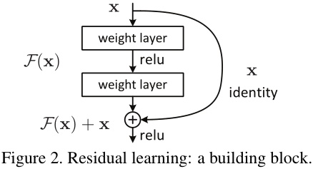

原来需要学习完全的重构映射，从头创建输出并不容易，而引入直连之后，只需要学习输出和原来输入的差值即可，绝对量变相对量，容易很多，所以叫残差网络。并且通过引入残差，identity恒等映射，相当于一个梯度高速通道，可以容易地训练避免梯度消失的问题，所以可以得到很深的网络，网络层数由GoogLeNet的22层到了ResNet的152层。

LeNet、AlexNet、VGG奠定了经典神经网络的基础，Inception和ResNet则展示了神经网络的新范式，在这两个范式的基础上，发展创新并相互借鉴，有了Inception流派的Inception v2到v4、Inception-ResNet v1和v2，以及ResNet流派的ResNeXt、DenseNet和Xception等。

- Inception v2: [Batch Normalization: Accelerating Deep Network Training by Reducing Internal Covariate Shift](https://arxiv.org/abs/1502.03167)， top5 error 4.8%，2015

主要是增加了Batch Normalization，之前神经网络很依赖于良好的初始化，并且网络太深会梯度弥散，这两个问题都是因为网络中间的激活的分布不理想，那既然我们想要一个理想的分布，就手动把它转换为理想的分布好了。所以在每一层输出后面加上了归一化变换，减去每个训练batch的每个特征的均值再除以标准差，得到0均值1标准差的输出分布，这样就可以很好地训练了，梯度也不容易弥散。

 - Inception v3: [Rethinking the Inception Architecture for Computer Vision](https://arxiv.org/abs/1512.00567)，top5 error 3.5%

卷积进一步分解，5x5用两个3x3卷积替换，7x7用三个3x3卷积替换，一个3x3卷积核可以进一步用1x3的卷积核和3x1的卷积核组合来替换，进一步减少计算量。
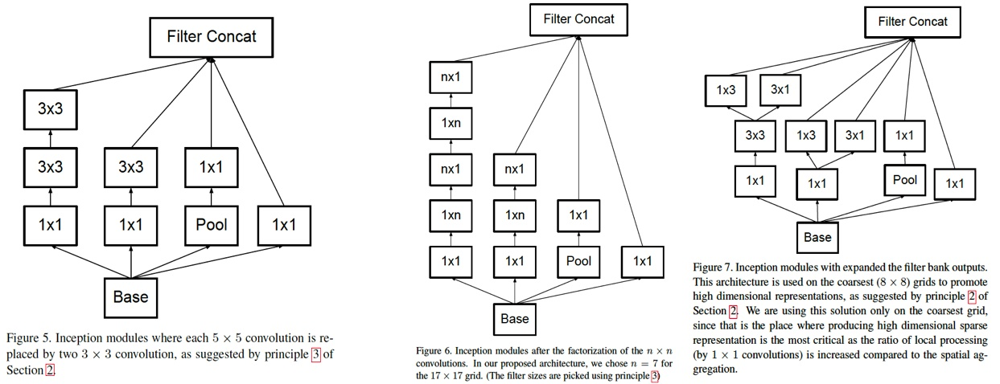

- Inception v4 和 Inception-ResNet:  [Inception-v4, Inception-ResNet and the Impact of Residual Connections on Learning](https://arxiv.org/abs/1602.07261)，top5 error 3.08%

Inception v1到v3，可以看到很明显的人工设计的痕迹，不同卷积核的和网络结构的安排很特殊，并不知道为什么要这样安排，实验确定的。TensorFlow的出现，网络可以按照理想的设计来实现了，于是很规范地设计了一个Inception v4网络，类似于Inception v3，但是没有很多特殊的不一致的设计。
ResNet证明了residual connection的有效性，所以为Inception模块引入了residual connection，得到Inception-ResNet v1和Inception-ResNet v2，前者规模较小，和Inception v3相当，后者规模较大，和Inception v4规模相当。residual的Inception模块：
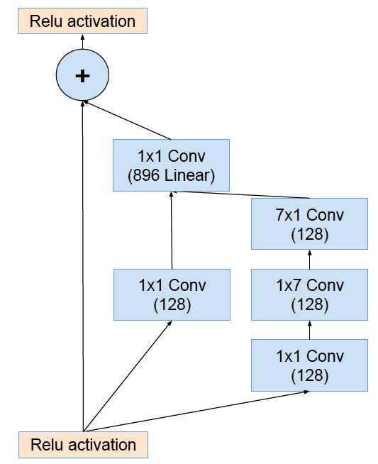

ResNet派系包括DenseNet、ResNeXt以及Xception等。

- DenseNet: [Densely Connected Convolutional Networks](https://arxiv.org/abs/1608.06993)

DenseNet将residual connection发挥到极致，每一层输出都直连到后面的所有层，可以更好地复用特征，每一层都比较浅，融合了来自前面所有层的所有特征，并且很容易训练。缺点是显存占用更大并且反向传播计算更复杂一点。
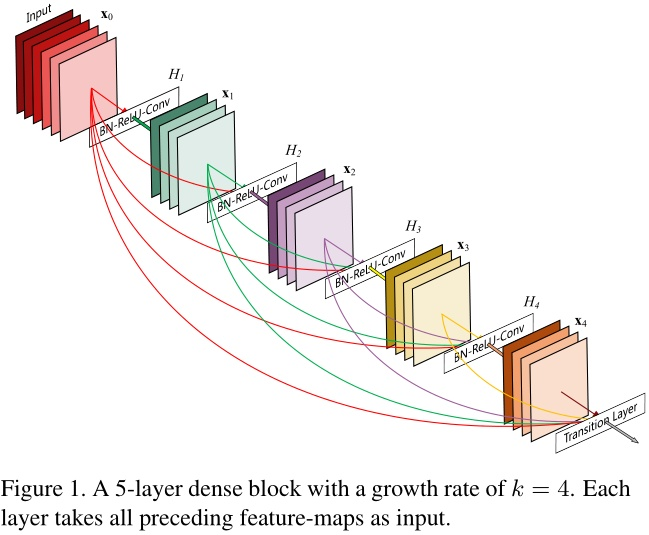

- ResNeXt:  [Aggregated Residual Transformations for Deep Neural Networks](https://arxiv.org/abs/1611.05431)   ImageNet Top5错误率：3.03%

Inception借鉴ResNet得到Inception-ResNet，而ResNet借鉴Inception得到了ResNeXt，对于每一个ResNet的每一个基本单元，横向扩展，将输入分为几组，使用相同的变换，进行卷积。左边是ResNet的基本结构，右边是ResNeXt的基本结构（下图）。在通道上对输入进行拆分，进行分组卷积，每个卷积核不用扩展到所有通道，可以得到更多更轻量的卷积核，并且，卷积核之间减少了耦合，用相同的计算量，可以得到更高的精度。
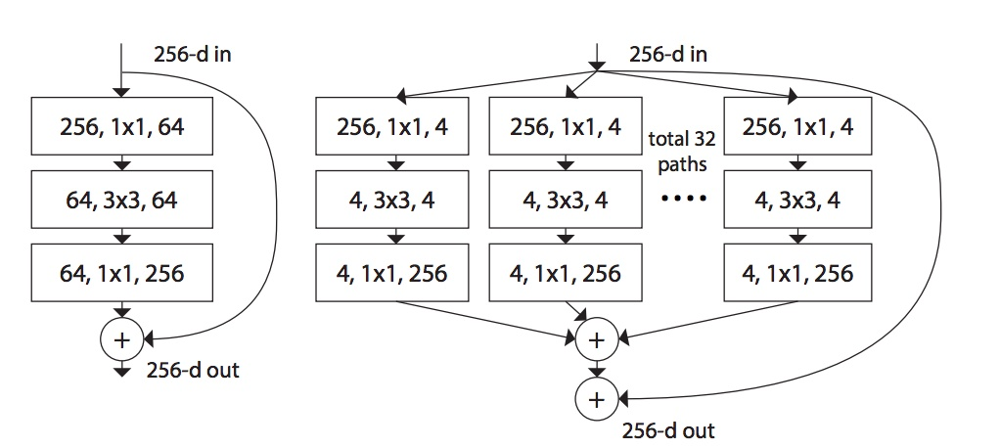

- Xception: [Xception: Deep Learning with Depthwise Separable Convolutions ](https://arxiv.org/abs/1610.02357)

Xception则把分组卷积的思想发挥到了极致，每一个通道单独分为一组。利用了depthwise separable convolution，J个输入通道，每个通道用一个单独的空间卷积核卷积（比如3x3），J个卷积核得到J个输出通道，然后再用K个卷积核对上一步得到的J个输出通道进行1x1的普通卷积，得到K个最终的输出。
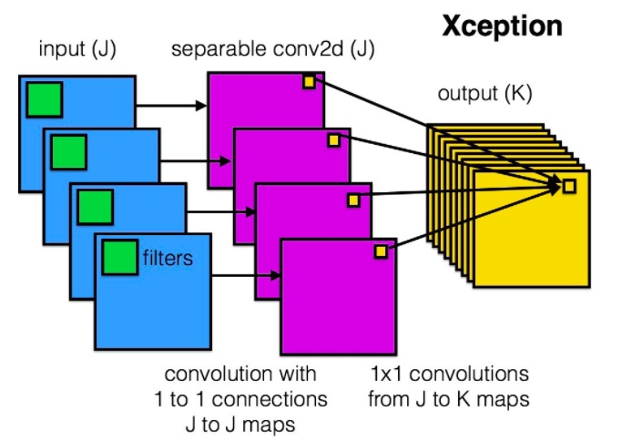

Xception基于一个假设，水平和竖直方向的空间卷积（比如第一步的3x3卷积）和深度方向的通道卷积（比如第二步的1x1卷积）可以完全独立进行，这样减少了不同操作间的耦合，可以有效利用计算力。实验证明，相同的计算量，精度有明显的提升。不过现在对于分组卷积的底层支持还不够好，实际速度并没有理论计算的那么好，需要底层库进行更好的支持。

移动端的应用也有SqueezeNet、MobileNet v1和v2、ShuffleNet等。

- MobileNet v1: [MobileNets: Efficient Convolutional Neural Networks for Mobile Vision Applications](https://arxiv.org/abs/1704.04861)

和Xception类似，通过depthwise separable convolution来减少计算量，设计了一个适用于移动端的，取得性能和效率间很好平衡的一个网络。

- MobileNet v2：[2018，Inverted Residuals and Linear Bottlenecks: Mobile Networks for Classification, Detection and Segmentation](https://128.84.21.199/pdf/1801.04381.pdf)

使用了ReLU6（即对ReLU输出的结果进行Clip，使得输出的最大值为6）适配移动设备更好量化，然后提出了一种新的Inverted Residuals and Linear Bottleneck，即ResNet基本结构中间使用了depthwise卷积，一个通道一个卷积核，减少计算量，中间的通道数比两头还多（ResNet像漏斗，MobileNet v2像柳叶），并且全去掉了最后输出的ReLU。
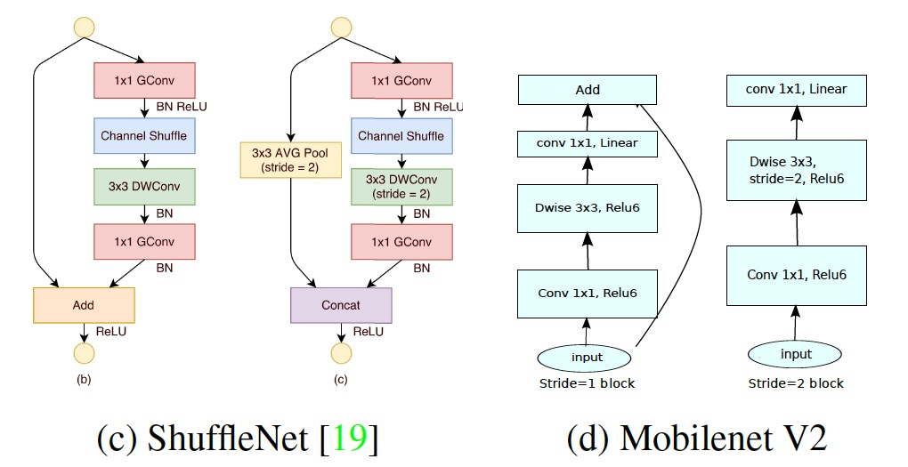

- ShuffleNet: [ShuffleNet: An Extremely Efficient Convolutional Neural Network for Mobile Devices](https://arxiv.org/abs/1707.01083)

Xception已经很好了，但是1x1那里太耗时间了成了计算的瓶颈，就分组来较少计算量，但是分组后组和组之间信息隔离了，那就重排shuffle一下，强行让信息流动。channel shuffle就是对通道进行重排，将每组卷积的输出分配到下一次卷积的不同组。
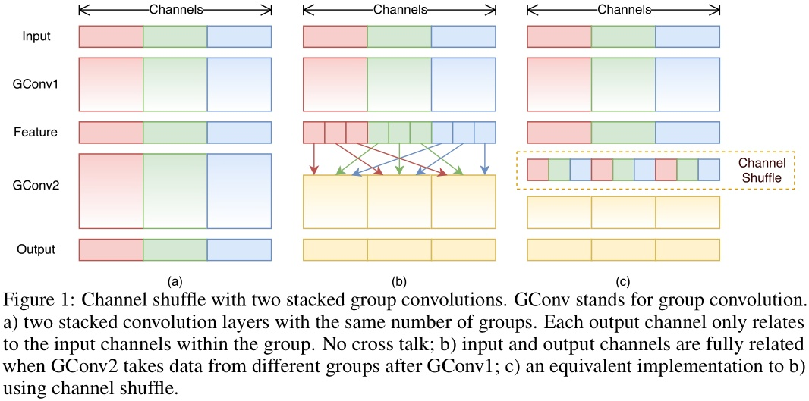

图a是没有shuffle，效果很差，b和c则是等价的有shuffle的。ShuffleNet可以达到和AlexNet相同的精度，并且实际速度快13倍。

 - SENet: [Squeeze-and-Excitation Networks](https://arxiv.org/abs/1709.01507)
  SENet的Squeeze-Excitation模块在普通的卷积（单层卷积或复合卷积）由输入X得到输出U以后，对U的每个通道进行全局平均池化得到通道描述子（Squeeze），再利用两层FC得到每个通道的权重值，对U按通道进行重新加权得到最终输出（Excitation），这个过程称之为feature recalibration，通过引入attention重新加权，可以得到抑制无效特征，提升有效特征的权重，并很容易地和现有网络结合，提升现有网络性能，而计算量不会增加太多。
  
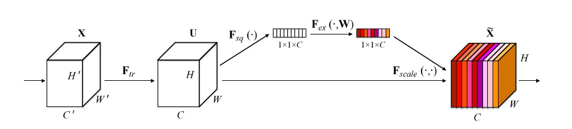  

一览：
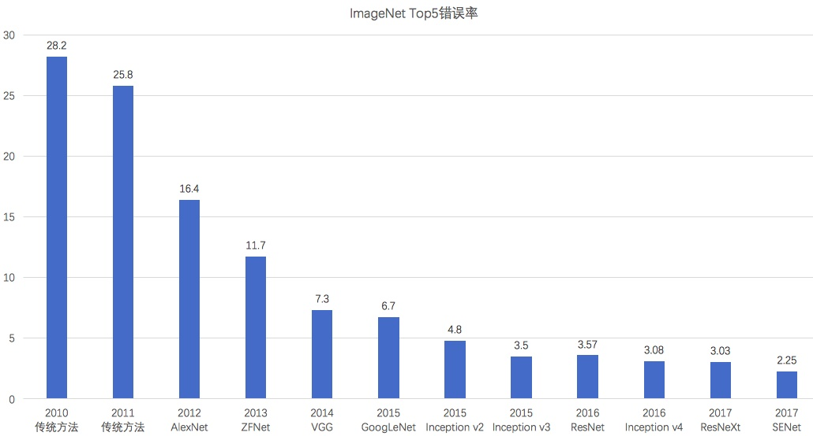  

网络选择的建议：
- 普通网络：推荐ResNet-50或Xception或Inception v3
- 大网络高精度：推荐ResNeXt-101（64x4d）或Inception-ResNet v2或DPN
- 移动端小网络：推荐ShuffleNet或MobileNet v2