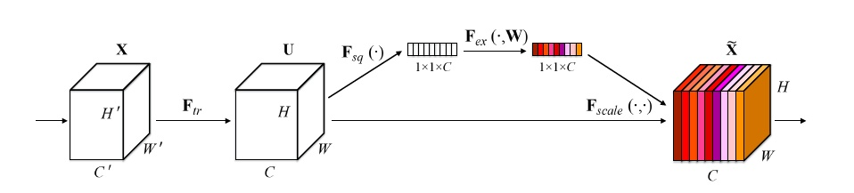

## SENet

- [Squeeze-and-Excitation Networks](https://arxiv.org/abs/1709.01507)

基本结构:

SENet和Inception的结合:

SENet和ResNet的结合:

SE block 包含Global Average Pooling-> FC -> ReLU -> FC -> Sigmoid，为了限制模型复杂度并增强泛化能力，使用2个全连接。第一个的FC会把通道降下来，然后第二个FC再把通道升上去，得到和通道数相同的C个权重，每个权重用于给对应的一个通道进行加权。r为超参数（缩减系数），实验确定选取16，可以得到较好的性能并且计算量相对较小。最后的sigmoid函数就是各通道的权重，根据输入数据调节各通道特征的权重，有助于增强特征的可分辨性

SENet一个很大的优点就是可以很方便地集成到现有网络中，提升网络性能，并且代价很小。

SE-ResNet50的网络结构：
