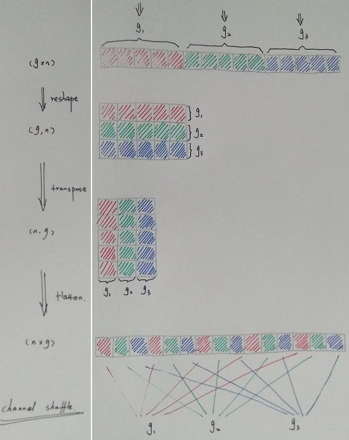
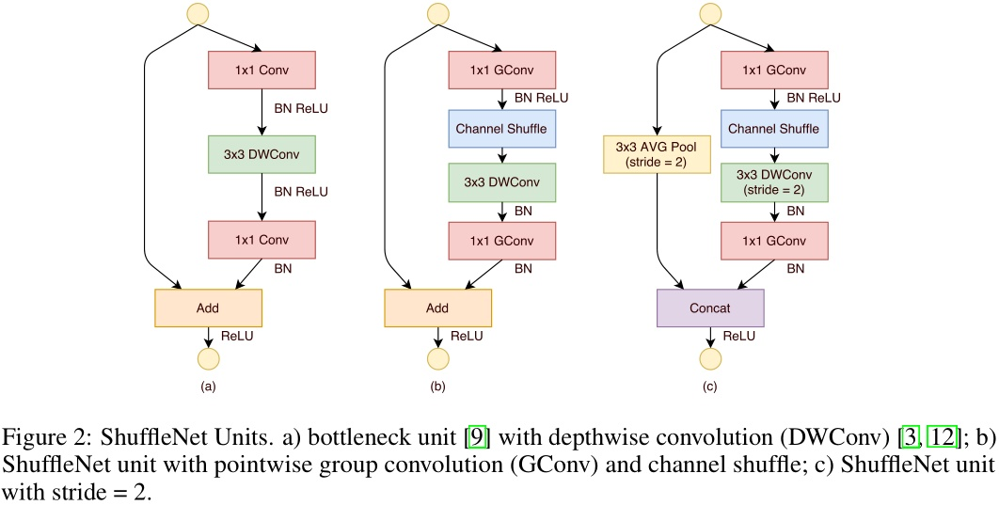
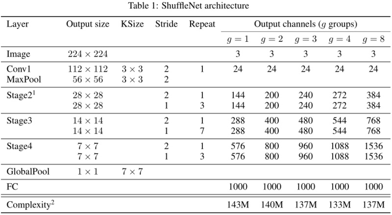
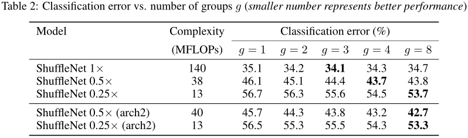
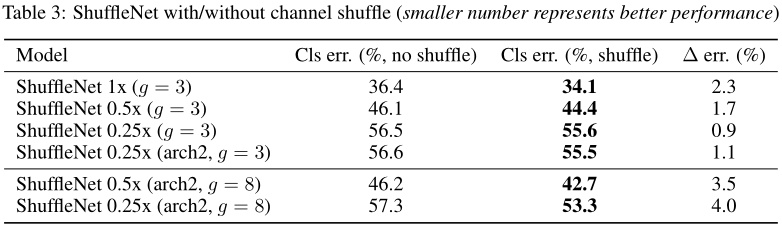

## ShuffleNet

- 论文：[ShuffleNet: An Extremely Efficient Convolutional Neural Network for Mobile Devices](https://arxiv.org/abs/1707.01083)

ShuffleNet，主要应用于计算能力有限的移动设备中。ShuffleNet的特点：逐点分组卷积和通道重排。因为先进的基础网络架构如Xception、ResNeXt在极小的网络中计算效率变低，主要耗费在密集的1x1卷积计算上。ShuffleNet使用逐点分组卷积（pointwise group convolution）替代1x1卷积来减小计算复杂度，另为了消除其带来的副作用，使用通道重排（channel shuffle）来改进特征通道中的信息流动，基于这两个操作构建了高效计算的ShuffleNet。在同样的计算开支下，ShuffleNet比其他流行的机构有更多的特征图通道数量，可以编码更多的信息，这对于很小的网络的性能是尤为重要的。

如果让每个组的卷积可以获得其他组的输入数据（如图(b)），那么输入/输出的各通道就是完全相关的。为了达到这个目的，可以将每组卷积的输出再细分，然后将细分的子组分别传输到下一层的不同组中。这个操作可以由通道重排（channel shuffle）来实现：假设分为g个组进行卷积，每组输出n个通道，那么输出的总通道数就是g*n，先将输出的维度变成(g,n)，然后转置，最后还原为n*g的数据即可，结果如图(c)所示。

通道重排（channel shuffle）流程:

ShuffleNet基本单元:

图a是ResNet结构，将残差block中的3x3卷积层替换为逐通道卷积（depthwise convolution）。图b是ShuffleNet结构，先经过1x1通道分组卷积，然后通道重排，再3x3的逐通道卷积(depthwise convolution)，然后再经过一个1x1的通道分组卷积（为了恢复原来的通道维度）。图c是要进行降维时，在快捷连接（shortcut path）上添加尺寸3x3步幅2的平均池化层，逐通道卷积步幅为2，最后将两者相加的操作替换为拼接，这样输出通道数就可加倍。

ShuffleNet的计算量要低得多。假设输入数据大小为`c*h*w`，bottleneck层（1x1+3x3+1x1）通道数为m，那么ResNet单元需要`h*w(2c*m+9m*m)` FLOPs，ResNeXt需要`h*w(2c*m+9m*m/g)` FLOPs，而ShuffleNet只需要`h*w(2c*m/g+9m)` FLOPs，其中g为分组数量。
逐通道卷积理论上有很低的计算量，但在低功率移动设备上很难有效实现，与密集运算相比计算/内存访问率要差，Xception论文中也提到了这个问题。在ShuffleNet中故意只在bottleneck层（3x3卷积）上使用逐通道卷积以避免这种开支。

ShuffleNet网络结构:

ShuffleNet的基础是逐点分组卷积和通道重排，分别考察这两者的作用。

不同分组数量的性能对比:

分组卷积可以提升网络性能，并且网络越小越可以从分组数量的增加中获益，而规模较大的则会趋于饱和。arch2减少stage3中的block数量但增加每个block中的特征图数量，整体的复杂度基本保持不变，性能比之前有一定提升，这说明更宽的特征图对于较小的模型更为重要。

是否通道重排对比:

当分组数量g很大时，添加通道重排可以极大提升性能，这显示了跨通道信息交换的重要性。