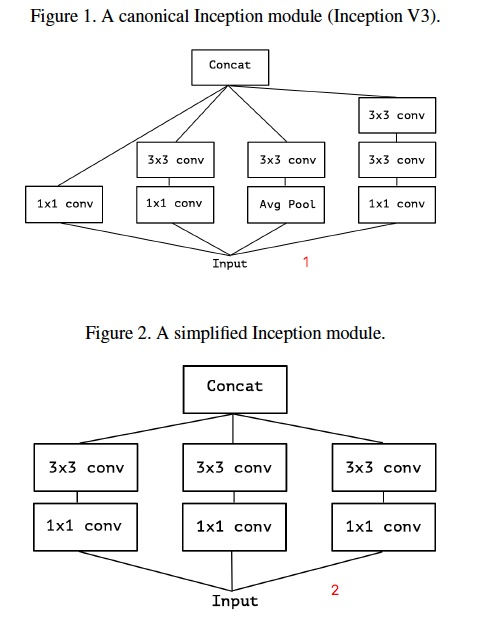
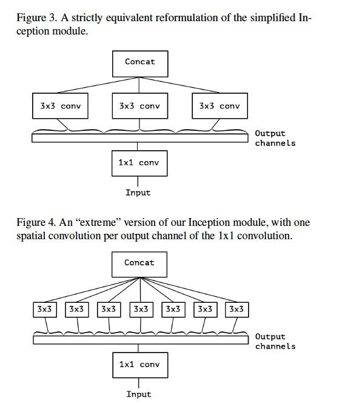
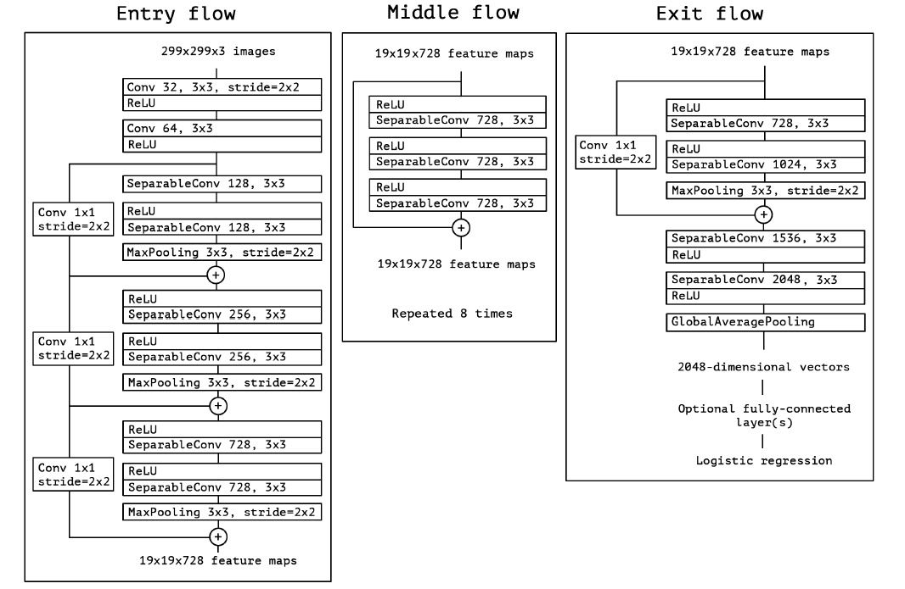

## Xception:

- 论文：[Xception: Deep Learning with Depthwise Separable Convolutions ](https://arxiv.org/abs/1610.02357)

Xception 取名由来是 “ Extreme Inception”， Xception是继Inception后提出的对Inception v3的另一种改进，主要是采用depthwise separable convolution来替换原来Inception v3中的卷积操作。

图一是Inception V3结构中原始的Inception模块。图二是简化的结构，基本上先通过一系列1x1卷积降维，然后再通过3x3卷积提取特征。图三是等价图二，1x1卷积将输入数据的channel维度上进行了拆解，再输送到空间卷积3x3。图四是极端的情况，3x3卷积在1x1卷积后的每一个通道上运行。

实际上实现网络结构的时候，并没有使用上面的结构，而是通过depthwise separable convolution来实现。
depthwise separable convolution具体操作由两步构成：
- 先对于输入的每个通道，用一个卷积核卷积，输出一个激活图，所以J个输入通道平面，输出J个输出通道平面
- 再用1x1对于上一步输出的J个通道的激活图进行正常卷积，K个1x1的卷积核，得到K个输出通道

Extreme  Inception 和depthwise separable convolution 的区别：
- 3x3卷积和1x1卷积的先后顺序。 原来的Inception结构是先1x1卷积，后3x3卷积（先通道再空间）；depth wise separable convolutions是先进行3x3卷积，然后1x1卷积（先空间再通道）。作者认为这里的区别并不重要。
- 两个卷积层之间是否有激活函数。 原来的Inception中间是有ReLU激活的；depthwise separable convolution的两个操作之间没有激励函数，实验结果证明不加激活效果更好。

网络结构：

整个网络结构，不仅借鉴了depthwise separable convolution的思想，也结合了ResNet的思想。左侧是输入部分，中间是重复8次的基本结构，右侧是输出部分。SparsableConv就是depthwise separable convolution，是depthwise convolution 和 1X1 卷积的结合。每个小块的连接采用的是residule connection（图中的加号），而不是原Inception中的concat。整个网络结构具有14个模块，36个卷积，除最后一个外，模块间有线性残差连接。

Xception作为Inception v3的改进，主要是在Inception v3的基础上引入了depthwise separable convolution，在基本不增加网络复杂度的前提下提高了模型的效果。有些人会好奇为什么引入depthwise separable convolution没有大大降低网络的复杂度，因为depthwise separable convolution在mobileNet中主要就是为了降低网络的复杂度而设计的。原因是作者加宽了网络，使得参数数量和Inception v3差不多，然后在这前提下比较性能。因此Xception目的不在于模型压缩，而是提高性能。

从卷积的分组来看：
- 分1组，即不分组，就是普通的卷积，比如VGG16和ResNet

- 分3组或4组，就是Inception

- 分32组或64组，就是ResNeXt

- 分到极限，每个通道一组，就是Xception  
  Xception就可以完全实现空间上的卷积和通道上的卷积的独立，各个操作之间减少耦合，充分利用计算力，用较小的尺寸达到了很好的效果。

CNN结构演化图:
